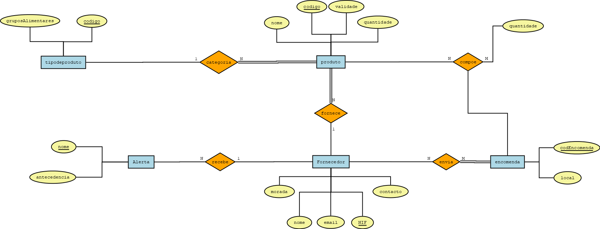

# C2 : Esquema conceptual

## Modelo E/A

### Entidades: 

PRODUTO (nome, <ins>código</ins>, validade, quantidade)

TIPODEPRODUTO (gruposAlimentares, <ins>código</ins>)

ENCOMENDA (<ins> codEncomenda </ins>, local)

FORNECEDOR (nome, <ins> NIF </ins>, email, morada, contacto)

ALERTA (<ins> nome </ins>, antecedência)

### Associações:

Recebe (ALERTA, FORNECEDOR)			       N:1 P/P

Categoria (TIPODEPRODUTO, PRODUTO)     1:N P/T

fornece (FORNECEDOR, PRODUTO)		       1:N P/T

compõe (PRODUTO, ENCOMENDA)            N:M P/P

envia (FORNECEDOR, ENCOMENDA)          N:M P/T

### Diagrama: 
   

Diagrama do modelo Entidade-Associações  

## Regras de negócio adicionais (Restrições)
_O dono apenas terá acesso à gerencia no caso do gerente não estar presente_

---
[< Previous](rebd01.md) | [^ Main](https://github.com/TCM21-SIBD03/reportSIBD) | [Next >](rebd03.md)
:--- | :---: | ---: 
