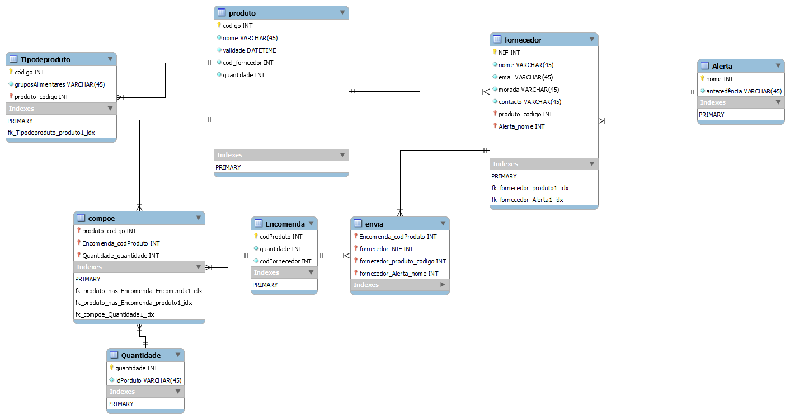

# C4 : Esquema Relacional  <!-- omit in toc -->

## Relações

### Tabelas: 

##### Descrição das tabelas: 

| **Nome** | **Descrição** |
| --- | --- |
| **Produto** | Informação sobre os produtos comercializados. | 
| **Tipodeprodutos** | Diversidade dos produtos. | 
| **Fornecedor** | Informações sobre quem fornece os produtos. | 
| **Alerta** | Aviso quando é necessário um reabastecimento. |
| **envia** | O fornecedor envia os produtos. | 
| **Encomenda** |Informações sobre os produtos necessários no supermercado e pedidos pelo mesmo. | 
| **compoe** | Composição da encomenta pedida. | 
| **quantidade** | Quantidade dos produtos pedidos. | 

## Vistas

Não existem.

---
| [< Previous](rebd03.md) | [^ Main](https://github.com/TCM21-SIBD03/reportSIBD) | [Next >](rebd05.md) |
| :---------------------- | :------------------------------------------------------: | ------------------: |
