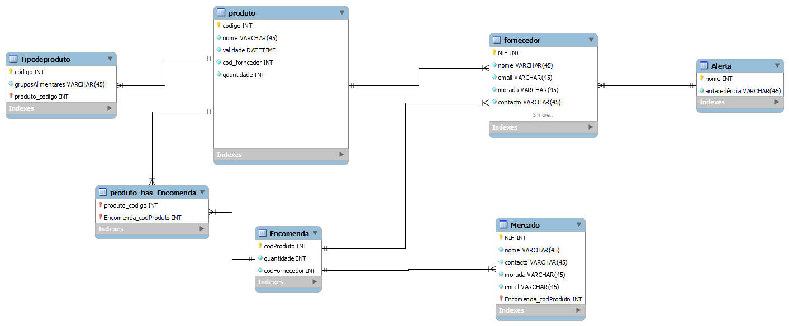

# C4 : Esquema Relacional  <!-- omit in toc -->

## Relações

### Tabelas: 

## Vistas

_(Inserir a descrição e estrutura das vista, caso existam.)_

---
| [< Previous](rebd03.md) | [^ Main](https://github.com/TCM21-SIBD03/reportSIBD) | [Next >](rebd05.md) |
| :---------------------- | :------------------------------------------------------: | ------------------: |
