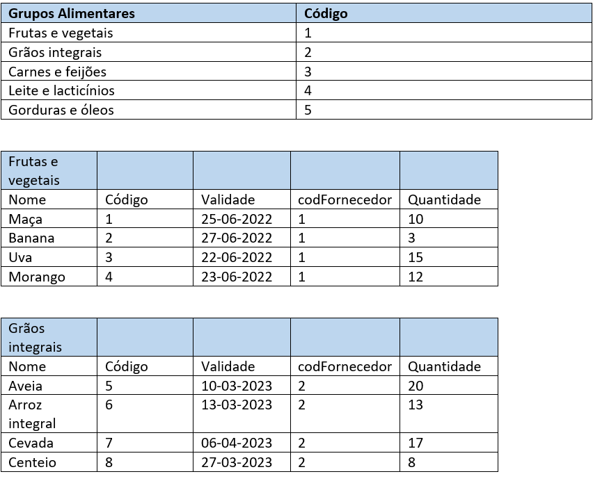
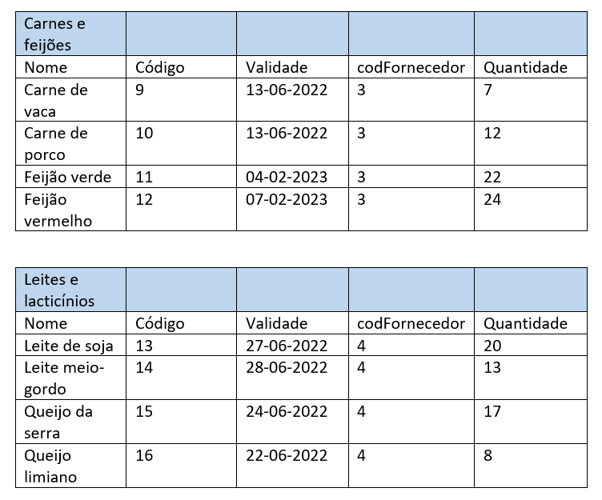
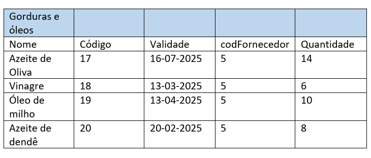

# C5 : SQL

## DDL

CREATE SCHEMA IF NOT EXISTS `mydb` DEFAULT CHARACTER SET utf8 ;
USE `mydb` ;

-- -----------------------------------------------------
-- Table `mydb`.`produto`
-- -----------------------------------------------------
CREATE TABLE IF NOT EXISTS `mydb`.`produto` (
  `codigo` INT NOT NULL AUTO_INCREMENT,
  `nome` VARCHAR(45) NOT NULL,
  `validade` DATETIME NOT NULL,
  `cod_forncedor` INT NOT NULL,
  `quantidade` INT NOT NULL,
  PRIMARY KEY (`codigo`))
ENGINE = InnoDB;

-- -----------------------------------------------------
-- Table `mydb`.`Alerta`
-- -----------------------------------------------------
CREATE TABLE IF NOT EXISTS `mydb`.`Alerta` (
  `nome` INT NOT NULL AUTO_INCREMENT,
  `antecedência` VARCHAR(45) NOT NULL,
  PRIMARY KEY (`nome`))
ENGINE = InnoDB;

-- -----------------------------------------------------
-- Table `mydb`.`fornecedor`
-- -----------------------------------------------------
CREATE TABLE IF NOT EXISTS `mydb`.`fornecedor` (
  `NIF` INT NOT NULL AUTO_INCREMENT,
  `nome` VARCHAR(45) NOT NULL,
  `email` VARCHAR(45) NOT NULL,
  `morada` VARCHAR(45) NOT NULL,
  `contacto` VARCHAR(45) NOT NULL,
  `produto_codigo` INT NOT NULL,
  `Alerta_nome` INT NOT NULL,
  PRIMARY KEY (`NIF`, `produto_codigo`, `Alerta_nome`),
  INDEX `fk_fornecedor_produto1_idx` (`produto_codigo` ASC) VISIBLE,
  INDEX `fk_fornecedor_Alerta1_idx` (`Alerta_nome` ASC) VISIBLE,
  CONSTRAINT `fk_fornecedor_produto1`
    FOREIGN KEY (`produto_codigo`)
    REFERENCES `mydb`.`produto` (`codigo`)
    ON DELETE NO ACTION
    ON UPDATE NO ACTION,
  CONSTRAINT `fk_fornecedor_Alerta1`
    FOREIGN KEY (`Alerta_nome`)
    REFERENCES `mydb`.`Alerta` (`nome`)
    ON DELETE NO ACTION
    ON UPDATE NO ACTION)
ENGINE = InnoDB;

-- -----------------------------------------------------
-- Table `mydb`.`Tipodeproduto`
-- -----------------------------------------------------
CREATE TABLE IF NOT EXISTS `mydb`.`Tipodeproduto` (
  `código` INT NOT NULL AUTO_INCREMENT,
  `gruposAlimentares` VARCHAR(45) NOT NULL,
  `produto_codigo` INT NOT NULL,
  PRIMARY KEY (`código`, `produto_codigo`),
  INDEX `fk_Tipodeproduto_produto1_idx` (`produto_codigo` ASC) VISIBLE,
  CONSTRAINT `fk_Tipodeproduto_produto1`
    FOREIGN KEY (`produto_codigo`)
    REFERENCES `mydb`.`produto` (`codigo`)
    ON DELETE NO ACTION
    ON UPDATE NO ACTION)
ENGINE = InnoDB;

-- -----------------------------------------------------
-- Table `mydb`.`Encomenda`
-- -----------------------------------------------------
CREATE TABLE IF NOT EXISTS `mydb`.`Encomenda` (
  `codProduto` INT NOT NULL AUTO_INCREMENT,
  `quantidade` INT NOT NULL,
  `codFornecedor` INT NOT NULL,
  PRIMARY KEY (`codProduto`))
ENGINE = InnoDB;

-- -----------------------------------------------------
-- Table `mydb`.`Quantidade`
-- -----------------------------------------------------
CREATE TABLE IF NOT EXISTS `mydb`.`Quantidade` (
  `quantidade` INT NOT NULL AUTO_INCREMENT,
  `idPorduto` VARCHAR(45) NOT NULL,
  PRIMARY KEY (`quantidade`))
ENGINE = InnoDB;

-- -----------------------------------------------------
-- Table `mydb`.`compoe`
-- -----------------------------------------------------
CREATE TABLE IF NOT EXISTS `mydb`.`compoe` (
  `produto_codigo` INT NOT NULL,
  `Encomenda_codProduto` INT NOT NULL,
  `Quantidade_quantidade` INT NOT NULL,
  PRIMARY KEY (`produto_codigo`, `Encomenda_codProduto`, `Quantidade_quantidade`),
  INDEX `fk_produto_has_Encomenda_Encomenda1_idx` (`Encomenda_codProduto` ASC) VISIBLE,
  INDEX `fk_produto_has_Encomenda_produto1_idx` (`produto_codigo` ASC) VISIBLE,
  INDEX `fk_compoe_Quantidade1_idx` (`Quantidade_quantidade` ASC) VISIBLE,
  CONSTRAINT `fk_produto_has_Encomenda_produto1`
    FOREIGN KEY (`produto_codigo`)
    REFERENCES `mydb`.`produto` (`codigo`)
    ON DELETE NO ACTION
    ON UPDATE NO ACTION,
  CONSTRAINT `fk_produto_has_Encomenda_Encomenda1`
    FOREIGN KEY (`Encomenda_codProduto`)
    REFERENCES `mydb`.`Encomenda` (`codProduto`)
    ON DELETE NO ACTION
    ON UPDATE NO ACTION,
  CONSTRAINT `fk_compoe_Quantidade1`
    FOREIGN KEY (`Quantidade_quantidade`)
    REFERENCES `mydb`.`Quantidade` (`quantidade`)
    ON DELETE NO ACTION
    ON UPDATE NO ACTION)
ENGINE = InnoDB;

-- -----------------------------------------------------
-- Table `mydb`.`envia`
-- -----------------------------------------------------
CREATE TABLE IF NOT EXISTS `mydb`.`envia` (
  `Encomenda_codProduto` INT NOT NULL,
  `fornecedor_NIF` INT NOT NULL,
  `fornecedor_produto_codigo` INT NOT NULL,
  `fornecedor_Alerta_nome` INT NOT NULL,
  PRIMARY KEY (`Encomenda_codProduto`, `fornecedor_NIF`, `fornecedor_produto_codigo`, `fornecedor_Alerta_nome`),
  INDEX `fk_Encomenda_has_fornecedor_fornecedor1_idx` (`fornecedor_NIF` ASC, `fornecedor_produto_codigo` ASC, `fornecedor_Alerta_nome` ASC) VISIBLE,
  INDEX `fk_Encomenda_has_fornecedor_Encomenda1_idx` (`Encomenda_codProduto` ASC) VISIBLE,
  CONSTRAINT `fk_Encomenda_has_fornecedor_Encomenda1`
    FOREIGN KEY (`Encomenda_codProduto`)
    REFERENCES `mydb`.`Encomenda` (`codProduto`)
    ON DELETE NO ACTION
    ON UPDATE NO ACTION,
  CONSTRAINT `fk_Encomenda_has_fornecedor_fornecedor1`
    FOREIGN KEY (`fornecedor_NIF` , `fornecedor_produto_codigo` , `fornecedor_Alerta_nome`)
    REFERENCES `mydb`.`fornecedor` (`NIF` , `produto_codigo` , `Alerta_nome`)
    ON DELETE NO ACTION
    ON UPDATE NO ACTION)
ENGINE = InnoDB;

SET SQL_MODE=@OLD_SQL_MODE;
SET FOREIGN_KEY_CHECKS=@OLD_FOREIGN_KEY_CHECKS;
SET UNIQUE_CHECKS=@OLD_UNIQUE_CHECKS;

## DML

### Tabelas: 

#### Seleciona os azeites de Oliva existente no supermercado.

Select    Azeite de Oliva

From    Gorduras e óleos

#### Seleciona as frutas e vegetais que tenham quantidade inferior a 4.

Select    Maça, Banana, Uva, Morango

From   Frutas e vegetais

Where   quantidade < 4

#### Seleciona as carnes e feijões que tenham validade superior a 30 dias.

Select    Carne de vaca, Carne de porco, Feijão verde, feijão vermelho
From    carnes e feijões
Where   validade > 30

---
[< Previous](rebd04.md) | [^ Main](https://github.com/TCM21-SIBD03/reportSIBD) | Next >
:--- | :---: | ---: 
