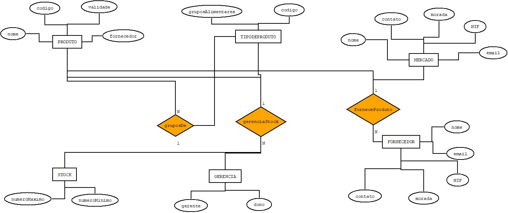

# C3 : Esquema conceptual

## Modelo E/A

### Entidades: 

PRODUTO (nome, código, validade, fornecedor) 

TIPODEPRODUTO( gruposAlimentares, código)

MERCADO (nome, contato, morada, email,NIF)

GERENCIA (gerente, dono)

STOCK (numeroMinimo, numeroMaximo)

FORNECEDOR (nome, NIF, email, morada, contato)

### Associações:

gruposDe (PRODUTO, TIPODEPRODUTO)				       N:1 T/P

gerenciaStock(GERENCIA, STOCK, PRODUTO, TIPODEPRODUTO)     1:N T/T

forneceProduto(FORNECEDOR, MERCADO, PRODUTO)		        1:N T/T

### Diagrama: 
   

Diagrama do modelo Entidade-Associações  

## Regras de negócio adicionais (Restrições)
_(Apresentar uma lista detalhada das regras e restrições não possíveis de representar no modelo E/A, que visam a manutenção da consistência e integridade da modelação do problema)_

---
[< Previous](rei02.md) | [^ Main](https://github.com/TCM21-SIBD03/reportSIBD) | Next >
:--- | :---: | ---: 
